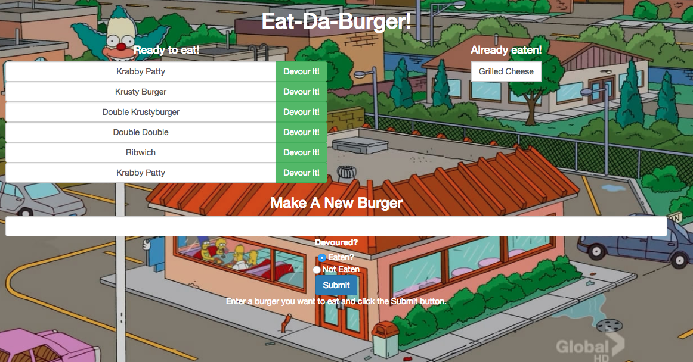
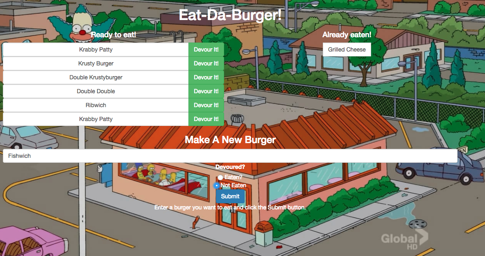

# burger

## Overview
A burger app using `Node`, `Express`, `Handlebars`, and `MySQL` that lets users input burgers into a menu, view what's on the menu, and devour them. 
> 

## How It Works
`ORM` created so that the app has 3 basic CRUD functionalities.
 * `CREATE` a new burger by entering burger info into `Make A New Burger` form.
 > 
 * `READ` all entries from the `MySQL` database and display on DOM using `Handlebars`.
 * `UPDATE` a burger by devouring it (i.e. clicking the `Devour` button) and moving it to the `Already Eaten` section. 